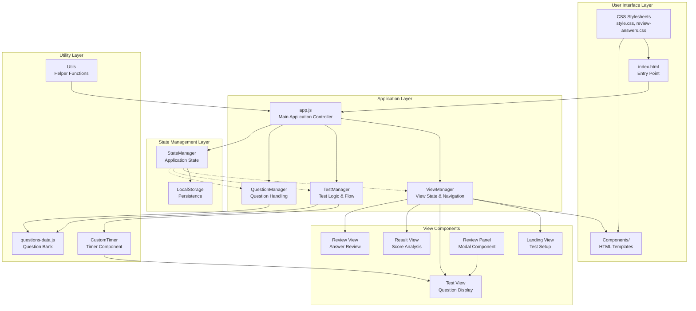
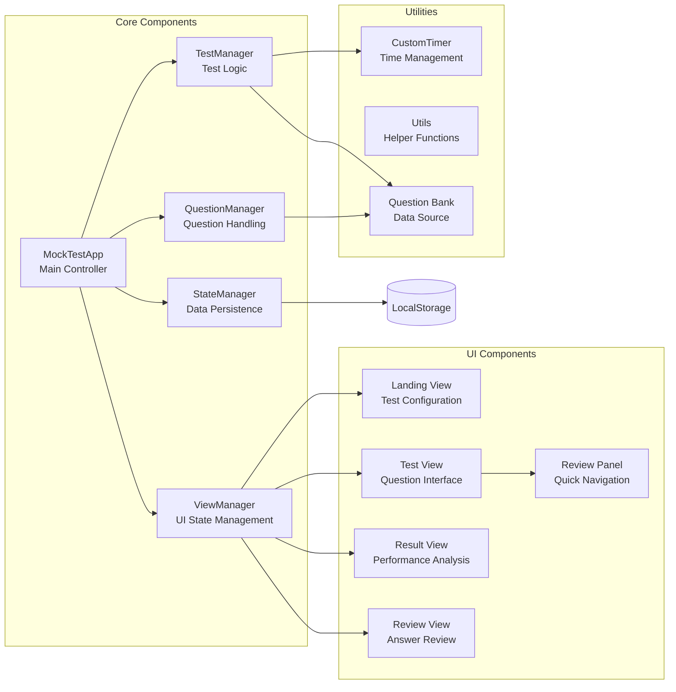
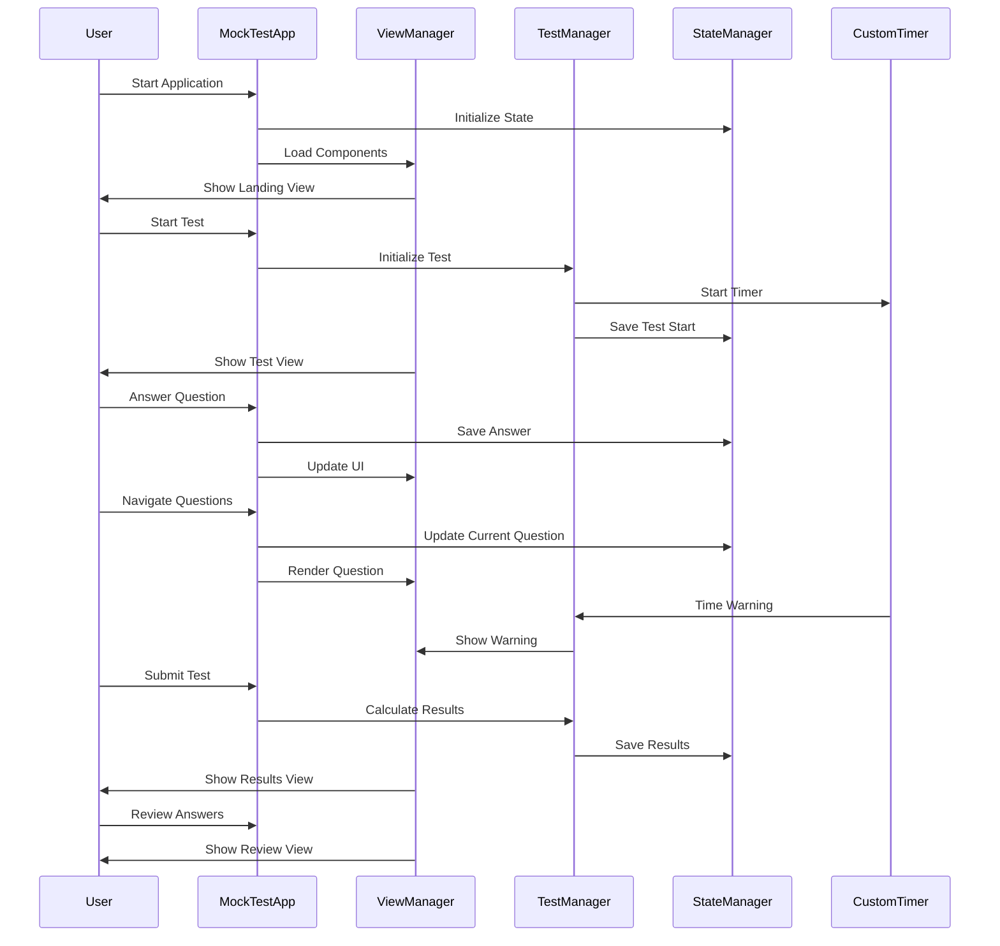
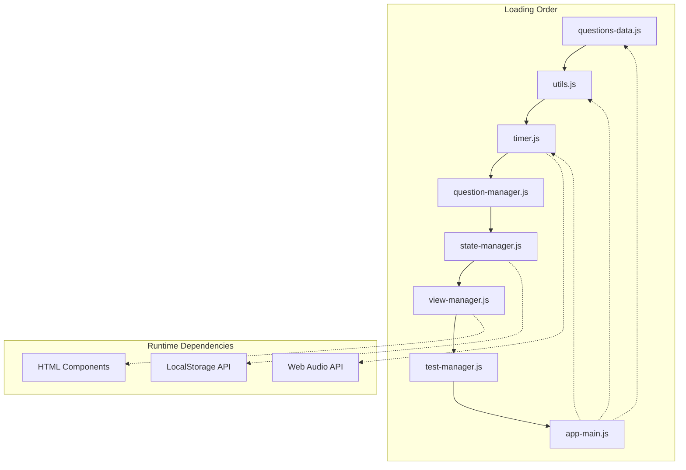

# Mock Test Application - Complete Full-Stack Solution

A comprehensive mock test application with **Vercel serverless backend** and **Neon PostgreSQL database** integration, cloud-based file management, and advanced analytics dashboard. Built with vanilla JavaScript, HTML, CSS, and **Node.js serverless functions**.

## 🏗️ Serverless Architecture

### Backend: Vercel Serverless Functions
- **Converted from Express.js** to individual serverless functions
- **File-based routing** following Vercel conventions
- **Optimized cold starts** with lazy database initialization
- **Scalable and cost-effective** deployment

### API Endpoints Structure
```
/api/
├── health.js                         (Health check)
├── test-files/
│   ├── index.js                      (List/Upload files)
│   ├── [id].js                       (Get/Update/Delete file)
│   └── [id]/results.js               (File results)
├── test-results/index.js             (Save results)
└── dashboard/                        (Analytics endpoints)
```

## 🚀 Key Features

### 📚 Complete Test Management System
- **Structured Test Files**: JSON-based test format with metadata and scoring
- **Cloud Storage**: Neon PostgreSQL database with full CRUD operations
- **File Management**: Upload, browse, rename, delete, and download test files
- **Real-time Validation**: Comprehensive format validation and error handling

### 🎯 Enhanced Exam Experience
- **File Context Display**: Shows test name and section during exam
- **Automatic Result Storage**: Saves comprehensive test results to database
- **Progress Tracking**: Visual progress indicators and time management
- **Review System**: Detailed answer review with explanations

### 📊 Advanced Analytics Dashboard
- **Performance Metrics**: Total attempts, average scores, best scores
- **Subject Analysis**: Performance breakdown by subject and chapter
- **Interactive Charts**: Chart.js integration with responsive design
- **Data Export**: CSV export functionality for external analysis

### 🎨 Professional User Experience
- **Toast Notifications**: Elegant feedback system for all operations
- **Responsive Design**: Optimized for mobile and desktop devices
- **Dark Mode Support**: Complete theme integration
- **Touch-Friendly**: Enhanced mobile interactions and accessibility

### 🔧 Developer Features
- **Serverless Architecture**: Vercel-ready deployment configuration
- **Environment Management**: Comprehensive environment variable setup
- **API Documentation**: Complete REST API with examples
- **Type Safety**: Structured data validation and error handling

## 📖 Quick Start

### Prerequisites
- Node.js 14+ 
- Neon PostgreSQL account
- Git for version control

### Installation
```bash
git clone https://github.com/Ravi-katta-dev/mocktest.git
cd mocktest
npm install
```

### Setup Database
1. Create a Neon database at [neon.tech](https://neon.tech)
2. Copy your connection string
3. Run the database schema from `database/schema.sql`

### Configure Environment
```bash
cp .env.example .env
# Edit .env with your database URL
```

### Run Locally
```bash
npm start
# Open index.html in your browser
```

### Deploy to Vercel
```bash
vercel
# Set environment variables in Vercel dashboard
```

## 📋 Test File Format

The application uses a structured JSON format for optimal database storage and feature support:

```json
{
  "section": "Physics - Units & Measurements",
  "total_questions": 35,
  "time_limit": 60,
  "target_score": "80%",
  "questions": [
    {
      "id": "q1_unique_id",
      "text": "Question text here",
      "options": ["Option A", "Option B", "Option C", "Option D"],
      "correct_answer": "Option A",
      "points": 2,
      "category": "Basic Units",
      "difficulty": "easy",
      "time_limit": 30,
      "solution": "Detailed explanation"
    }
  ],
  "scoring": {
    "total_points": 70,
    "passing_score": 56,
    "grade_scale": { "A": "63-70", "B": "56-62", "C": "49-55" }
  },
  "instructions": {
    "time_management": "Allocate time wisely",
    "difficulty_distribution": { "easy": "20", "medium": "12", "hard": "3" }
  }
}
```

## 🏗️ System Architecture



## Component Architecture



## Data Flow Architecture



## Module Dependencies



## Key Features & Capabilities

### 1. **Modular Architecture**
- Component-based design with clear separation of concerns
- Lazy loading of HTML components
- Dependency injection pattern

### 2. **State Management**
- Centralized state management with StateManager
- Persistent storage using LocalStorage
- State validation and recovery mechanisms

### 3. **Test Management**
- Comprehensive timer system with audio/visual alerts
- Question navigation and bookmarking
- Real-time answer tracking and validation

### 4. **User Interface**
- Responsive design with CSS custom properties
- Dark mode support
- Modal components for enhanced UX

### 5. **Performance Analytics**
- Topic-wise accuracy analysis
- Difficulty-based performance metrics
- Detailed question-wise breakdown

## Technology Stack

- **Frontend**: Vanilla JavaScript (ES6+)
- **Styling**: CSS3 with custom properties
- **Storage**: LocalStorage API
- **Audio**: Web Audio API
- **Charts**: Canvas-based rendering
- **Architecture**: Component-based modular design

## File Structure Overview

```
├── index.html              # Entry point
├── css/
│   ├── style.css          # Main styles
│   └── review-answers.css # Review component styles
├── js/
│   ├── app.js             # Main application
│   ├── view-manager.js    # View management
│   ├── test-manager.js    # Test logic
│   ├── question-manager.js # Question handling
│   ├── state-manager.js   # State management
│   ├── timer.js           # Timer component
│   ├── utils.js           # Utility functions
│   └── questions-data.js  # Question bank
└── components/
    ├── landing-view.html
    ├── test-view.html
    ├── result-view.html
    ├── review-answers-view.html
    └── review-panel.html
```

This architecture ensures scalability, maintainability, and optimal performance for the RRB Mock Test application focused on Units & Measurements.
